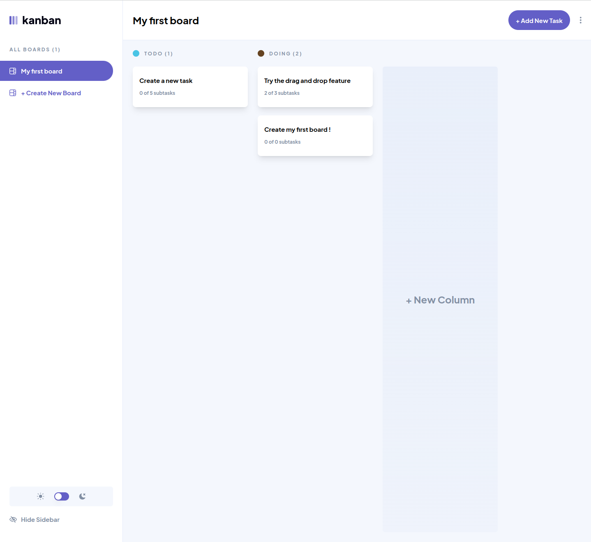

# Frontend Mentor - Kanban task management web app solution

This is a solution to the [Kanban task management web app challenge on Frontend Mentor](https://www.frontendmentor.io/challenges/kanban-task-management-web-app-wgQLt-HlbB). Frontend Mentor challenges help you improve your coding skills by building realistic projects.

## Table of contents

-   [Overview](#overview)
    -   [The challenge](#the-challenge)
    -   [Screenshot](#screenshot)
    -   [Links](#links)
-   [My process](#my-process)
    -   [Built with](#built-with)
    -   [What I learned](#what-i-learned)
    -   [Continued development](#continued-development)
    -   [Useful resources](#useful-resources)
-   [Author](#author)
-   [Acknowledgments](#acknowledgments)

## Overview

### The challenge

Users should be able to:

-   View the optimal layout for the app depending on their device's screen size
-   See hover states for all interactive elements on the page
-   Create, read, update, and delete boards and tasks
-   Receive form validations when trying to create/edit boards and tasks
-   Mark subtasks as complete and move tasks between columns
-   Hide/show the board sidebar
-   Toggle the theme between light/dark modes
-   **Bonus**: Allow users to drag and drop tasks to change their status and re-order them in a column
-   **Bonus**: Keep track of any changes, even after refreshing the browser (`localStorage` could be used for this if you're not building out a full-stack app)
-   **Bonus**: Build this project as a full-stack application

### Screenshot

### Links

-   Solution URL: [Link to the frontend mentor solution](https://www.frontendmentor.io/solutions/responsive-kanban-in-react-ts-featuring-clean-drag-and-drop-P_OOYLIc_C)
-   Live Site URL: [Link to the Kanban web app](https://kanban-lovat-beta.vercel.app/boards)

## My process

### Built with

-   [React](https://reactjs.org/) - JS library
-   [Vite](https://vitejs.dev/) - React bundler
-   [Shadcn](https://ui.shadcn.com/) - UI library component
-   [Tailwind](https://tailwindcss.com/) - CSS utilities
-   [Zustand](https://tailwindcss.com/) - State manager
-   [Tanstack Router](https://tanstack.com/router/latest) - React router

**Note: These are just examples. Delete this note and replace the list above with your own choices**

### What I learned

For this project I decided that I wanna give few lib I've never used a try, so I went with `Shadcn`, `Zustand` and `Tanstack Router`. So I've learned how to use them on the battlefield. It was hard, but rewarding at the end as I've been able to achieve everything I wanted to for this project. I'm sure I've made a lot of mistakes, but it works, and could be improved later in the futur when I'll be more familiar with these libraries

Use this section to recap over some of your major learnings while working through this project. Writing these out and providing code samples of areas you want to highlight is a great way to reinforce your own knowledge.

### Continued development

The first think that come to mind, is creating a backend with authentication, so that user can get their board across devices, but I'm really bad at doing backend stuff, so I didn't do it there.
Then, I think a lot of thing can be improved on the Zustand / Tanstack router/ Shadcn usage

### Useful resources

-   [Dnd complex example](https://codesandbox.io/p/sandbox/playground-0mine?file=%2Fsrc%2Fcomponents%2FDroppable.jsx%3A7%2C26) - This helped me for implementing the drag and drop feature on the board. I've changed things a bit to remove useless conditions, add some types, use early return as much as possible, but I don't think I would have been able to implement it from scratch. Big big kudo to the person who did this

## Author

-   Website - [Jason savelli](https://jasonsavelli.fr)
-   Frontend Mentor - [@Newpoki](https://www.frontendmentor.io/profile/Newpoki)
